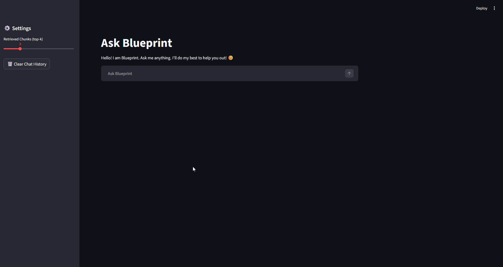

# Blueprint
### Precision RAG Chatbot 

**Blueprint** is a mini-RAG (Retrieval-Augmented Generation) pipeline designed to extract information from technical documents and provide grounded, AI-powered answers via a Streamlit interface.

---


---

## Table of Contents

- [Tech Stack](#tech-stack)
- [Architecture](#architecture)
- [Supported Document Types](#supported-document-types)
- [Evaluation & Grounding](#evaluation--grounding)
- [Getting Started](#getting-started)
- [Preview](#preview)
- [File Structure](#file-structure)
- [Features](#features)

---

## Tech Stack

- **LLM & Embeddings:** [OpenRouter API](https://openrouter.ai/)
  - **Embedding Model:** `nvidia/llama-nemotron-embed-vl-1b-v2:free`
  - **Generation Model:** OpenRouter Free LLMs
- **Vector Database:** [FAISS](https://github.com/facebookresearch/faiss) (Facebook AI Similarity Search)
- **Web Framework:** [Streamlit](https://streamlit.io/)
- **Core Libraries:** `numpy`, `python-dotenv`, `tiktoken`, `requests`, `pymupdf`, `python-docx`, `openpyxl`

---

## Architecture

The system is built on five core pillars:

1.  **Document Processing:** Loads, cleans, and chunks documents of multiple formats into manageable segments.
2.  **Vector Search:** Generates high-dimensional embeddings and manages the FAISS index for lightning-fast similarity lookups.
3.  **Query Processing:** Converts user questions into vectors to retrieve the Top-K most relevant context chunks.
4.  **Grounding Evaluation:** A custom scoring system that assesses how well the LLM's answer is supported by the retrieved data to prevent hallucinations.
5.  **Blueprint Interface:** A user-friendly chat environment with real-time transparency.

---

## Supported Document Types

Blueprint supports ingestion across five file formats. Simply drop any supported file into the `data/` folder and run `python embedding.py` to index it.

| Format | Extension | Parser Used | Notes |
| :--- | :--- | :--- | :--- |
| **Markdown** | `.md` | Built-in | Default format; ideal for structured notes and wikis |
| **PDF** | `.pdf` | PyMuPDF | Extracts text page-by-page; handles multi-page documents |
| **Word Document** | `.docx` | `python-docx` | Extracts paragraph-level text from Word files |
| **Plain Text** | `.txt` | Built-in | Plain text files |
| **Excel Spreadsheet** | `.xlsx` | `openpyxl` | Extracts cell data row-by-row across all sheets |

---

## Evaluation & Grounding

Every answer is assigned a **Grounding Score** to ensure reliability:

| Metric | Score | Meaning |
| :--- | :--- | :--- |
| **High Grounding** | 0.7 - 1.0 | Answer is well-supported by retrieved chunks. |
| **Medium Grounding** | 0.4 - 0.7 | Answer is relevant but may contain general knowledge. |
| **Low Grounding** | < 0.4 | **High Hallucination Risk.** Proceed with caution. |

---

## Getting Started

###  Installation
Clone the repository and install the necessary Python packages:
```bash
pip install -r requirements.txt
```

Enter your API Key in .env:
```
OPENRouter_API_KEY = {Your API key}
```

Add your documents to the data folder.

## Building: Run the following commands.
1. `python embedding.py` # Generates chunks and embeddings
2. `python vector_search.py` # Builds FAISS index

## Usage: Running web interface
`streamlit run app.py`

---

## Preview



---

## File Structure

```text
├── app.py                 # Streamlit web interface
├── embedding.py           # Document processing and embedding
├── vector_search.py       # FAISS index management
├── search_answer.py       # Query embedding and LLM generation
├── evaluation.py          # Grounding evaluation
├── requirements.txt       # Python dependencies
├── readme.md              # This documentation
├── result.json            # Example evaluation output
├── data/
│   ├── Example.txt        # Empty .txt file , replace with your documents
```

---

## Features
1. **Interface**: The web interface provides an environment for document queries.
2. **Multi-format Ingestion**: Supports `.md`, `.pdf`, `.docx`, `.txt`, and `.xlsx` files out of the box.
3. **Grounding Score**: When a user submits a query, the bot returns an answer accompanied by an evaluation score expressed as **% grounding** to indicate factual reliability.
4. **Source Transparency**: Includes a **dropdown menu** that reveals the specific **top-k retrieved chunks** used to generate the response.
5. **Dynamic Retrieval**: The **side panel** features a **slider** allowing users to adjust the number of retrieved chunks (top-k) as per their convenience.
6. **Session Management**: **Chat history** is persistently stored and displayed in the main chat window; it can be reset at any time using the **Clear Chat** button in the side panel.
